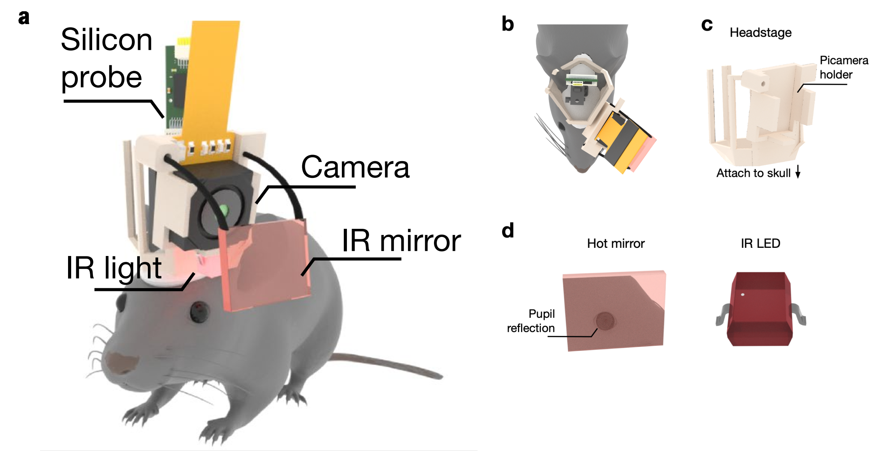
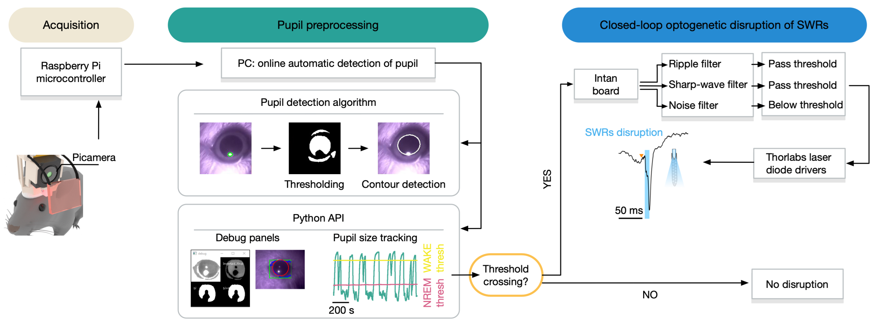
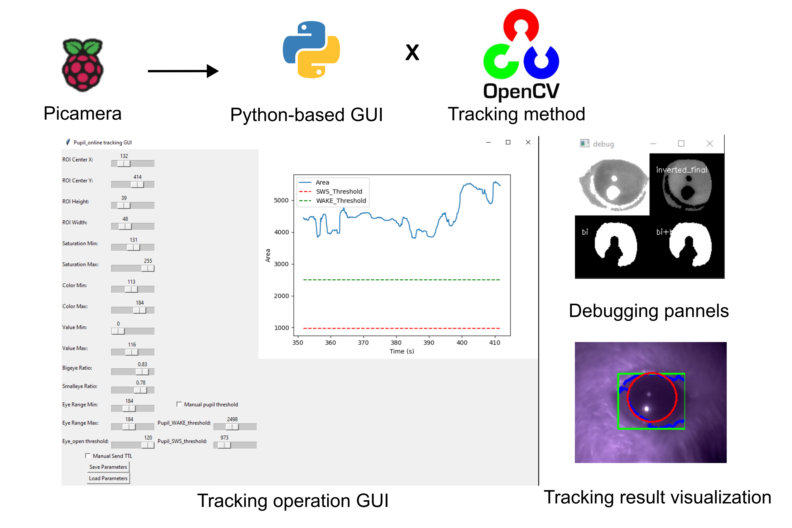
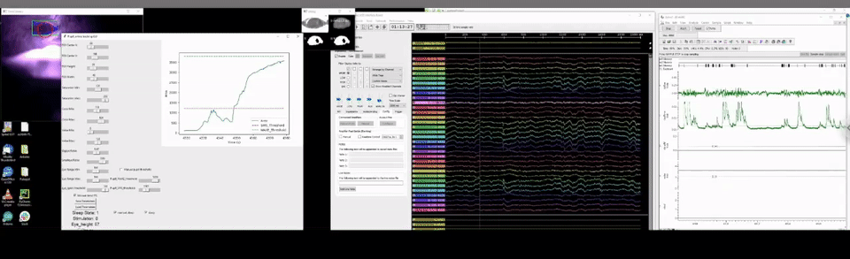

# Pupil Closed-Loop Control System Demo

This folder is a minimal, source-code-free overview of the system for demo use.

The system performs real-time pupil tracking during rodent sleep experiments and uses pupil-state information to gate downstream sharp-wave-ripple (SWR) closed-loop stimulation.

This demo package intentionally does not include source code. A full public release of the software and supporting materials will be released soon.

## What This System Does

- Records the eye with a Raspberry Pi camera and IR illumination.
- Streams the eye video to a PC for real-time pupil detection.
- Measures pupil size and eye opening continuously.
- Classifies behavioral state from pupil dynamics.
- Sends a trigger to a downstream SWR closed-loop system when the pupil crosses the configured threshold.
- Supports synchronized alignment with electrophysiology recordings.

## Main Components

1. Raspberry Pi camera system
2. PC workstation running the pupil-tracking pipeline
3. Intan electrophysiology recording hardware
4. SWR closed-loop stimulation system

## How The Workflow Operates

1. The Raspberry Pi camera captures the eye and sends video to the PC.
2. The PC detects the pupil in each frame and extracts measurements such as pupil area and eye height.
3. The tracking pipeline determines whether the current pupil state matches the experiment condition of interest.
4. If the threshold condition is met, the system sends a digital trigger that opens the SWR detection window.
5. The downstream SWR system checks electrophysiology signals and can trigger stimulation when ripple criteria are satisfied.

## Typical Outputs

- Annotated tracking videos
- Time-series pupil measurements
- Sleep-state or behavioral-state labels
- Trigger and stimulation event logs
- Synchronized timing with electrophysiology recordings

## Included Demo Assets

- `assets/eye_tracking_setup.png`: hardware concept for eye imaging on the animal
- `assets/pupil_closed_SWR_system.png`: end-to-end closed-loop system diagram
- `assets/realtime_pupil_tracking_gui.png`: real-time pupil-tracking GUI and logic overview
- `assets/online_tracking_preview.gif`: animated preview of the online tracking GUI and closed-loop SWR disruption output
- `assets/online_tracking.mp4`: demo video showing the online tracking GUI and closed-loop SWR disruption output

## Figures

### Hardware Setup

### Closed-Loop System Diagram

### Real-Time Tracking GUI

## Demo Video

Click the animated preview below to open the full MP4 demo:

## Release Status

This repository is provided for demonstration purposes only. The complete public release—including software, documentation, and additional materials—will be available soon at [ayalab1](https://github.com/ayalab1/).

